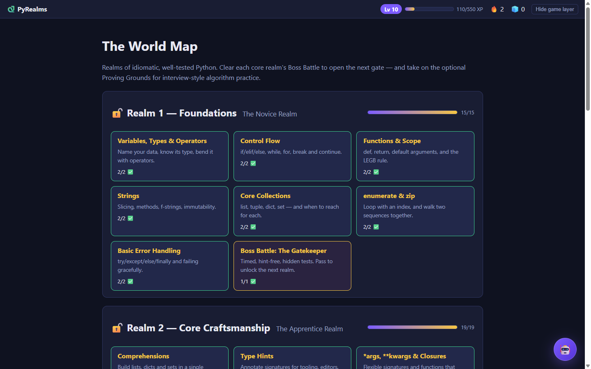
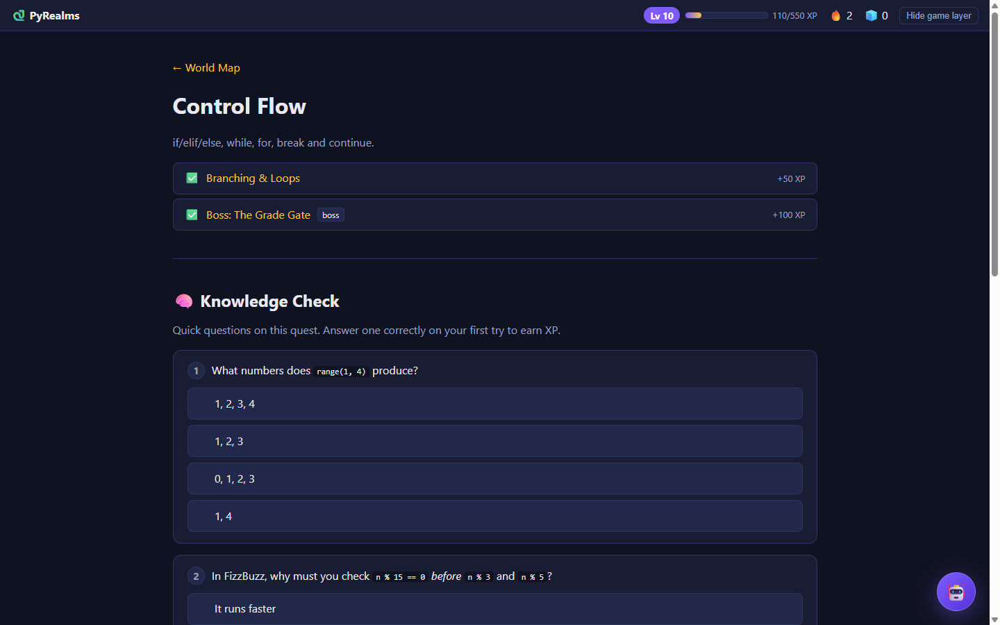
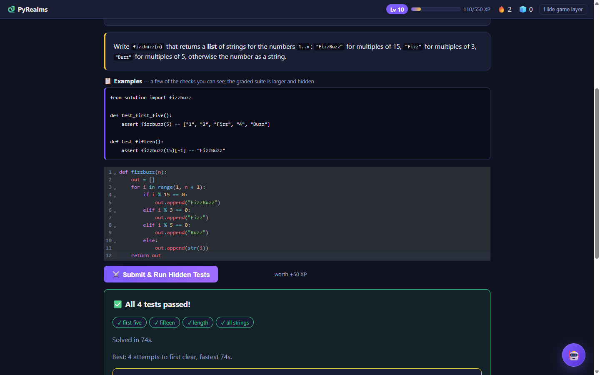
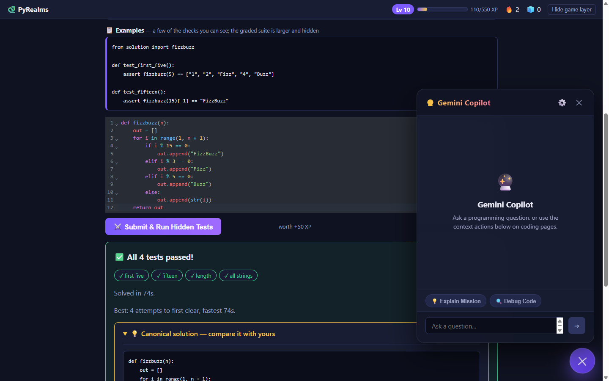

# 🐍 PyRealms

**Python Zero-to-Hero** — a gamified path from your first script to
idiomatic, well-tested Python, with an optional realm of interview-style
algorithm challenges. Built as a real app you run yourself.

[](LICENSE)
[](https://github.com/oasissan/pyrealms/actions/workflows/deploy.yml)

Tiered "Realms" of quests and missions, auto-graded by hidden pytest
suites — with visible example tests to learn from, a canonical solution
revealed once you pass, plus XP, levels, streaks, freeze tokens, badges,
and timed Boss Battles. Built with FastAPI + Jinja2 + HTMX + SQLite — no
build step, no JS framework, no account system. The codebase itself is
meant to double as advanced-Python practice for anyone reading it.

Design spec: [`docs/superpowers/specs/2026-07-05-python-zero-to-hero-design.md`](docs/superpowers/specs/2026-07-05-python-zero-to-hero-design.md)

## Screenshots

| The World Map | Quest + Knowledge Check |
|---|---|
|  |  |

| Mission — auto-graded challenge | Gemini Copilot |
|---|---|
|  |  |

## Quick start

```bash
git clone https://github.com/oasissan/pyrealms.git
cd pyrealms
python3 -m venv .venv
source .venv/bin/activate
pip install -r requirements.txt
python run.py            # http://127.0.0.1:8000
```

The SQLite database (`app.db`) is created and seeded with the Tier 1–3
curriculum on first startup. It's gitignored — delete it any time to
reset your progress and reseed from scratch.

## Features

- **25 quests, 47 challenges** across 3 core realms (Foundations, Core
  Craftsmanship, Pythonic Mastery) — each a short lesson + a coding
  challenge auto-graded against a hidden pytest suite — plus an **optional
  Proving Grounds realm** (6 quests, 11 challenges) of interview-style
  algorithms: recursion & Big-O, two pointers, sliding windows, hash-map
  patterns, and sort/search
- **Visible example tests** on every lesson challenge so you can see the
  expected input/output while you learn; Boss challenges stay fully hidden
- **A canonical solution** — idiomatic code plus a short "why" — revealed
  the moment you pass, so you can compare it against your own answer
- **XP & levels** — an append-only ledger (never a mutable counter), with
  levels gating access to later realms
- **Streaks with freeze tokens** — evaluated lazily on local dates, no
  midnight-cron timezone bugs; freeze tokens are *earned* (7-day streak),
  never bought
- **Badges** on a declarative rule engine, gated on passing a boss
  challenge — never on participation alone
- **Timed, hint-free Boss Battles** at the end of each realm
- **Personal-best tracking** (attempts-to-first-pass, fastest solve) —
  since there's no leaderboard, you compete against your own past runs
- **One-click toggle** to hide the entire gamified layer if you just want
  the curriculum
- **Gemini Copilot AI Chatbot** — A built-in coding assistant that helps explain challenges, debug code snippets, and answer programming questions.
  - **Free of Cost**: Mimics your browser-session Google Gemini login credentials.
  - **One-Click Setup**: Automatically detects and decrypts active session cookies (`__Secure-1PSID`/`__Secure-1PSIDTS`) from Chrome, Edge, or Firefox.
  - **Context-Aware**: Any question you ask automatically bundles details about the current mission, starter code, and your editor's live code.
- No accounts, no leaderboards, no monetization — see the design spec's
  ethics check for why


## How it works

- **Curriculum** — `app/content/tier{1,2,3,4}.py` are the seed data: each
  mission is a dict with a lesson, a prompt, starter code, a hidden pytest
  suite, optional visible `example_tests`, and a `solution_md` (canonical
  answer + why). `app/seed.py` loads them into SQLite on first boot.
  `tests/test_content.py` runs every mission's `solution_md` against its
  own hidden suite, so a solution can never silently rot.
- **Grading** — `app/grading.py` writes your submission to a temp dir and
  runs the hidden suite via `subprocess`, with a 5s timeout and a Unix
  memory cap. ⚠️ **Not a security sandbox** — fine for running on your own
  machine; if you deploy it somewhere reachable by others, put it behind
  auth (see `app/auth.py` — set `APP_USERNAME`/`APP_PASSWORD` env vars).
- **XP** — `app/services/xp.py`; current XP is `SUM(delta)` over
  `xp_ledger`, with idempotency keys so re-passing a challenge never
  double-awards.
- **Streaks & freezes** — `app/services/streak.py`.
- **Achievements** — `app/services/achievements.py`, a small rule engine
  evaluated on submission/streak events instead of scattered `if` checks.
- **Progress/unlocks** — `app/services/progress.py` computes what's
  unlocked on every request from submission history — no separate
  "progress" state to drift out of sync.
- **Gemini Copilot** — `app/services/gemini_web.py` houses a custom browser session client `GeminiWebClient` which extracts CSRF tokens from the web frontend of Gemini and sends authenticated chat messages. `app/routers/chatbot.py` handles auto-detecting cookies from browser caches on Windows (Chrome, Edge, Firefox), saving configs, and routing messages.


## Deploying it yourself

This is designed to run locally, but if you want it reachable elsewhere
(e.g. as a portfolio demo), see [`DEPLOY.md`](DEPLOY.md) for a free-tier
Oracle Cloud VM walkthrough with GitHub Actions auto-deploy on push. Set
`APP_USERNAME`/`APP_PASSWORD` before making it public — see the grading
caveat above.

## Roadmap

Done: Realms 1–3, the optional Proving Grounds (DSA/interview) realm,
visible example tests, post-pass solution reveals, full gamification loop,
local subprocess grading.

Stretch (not yet built): Realms 5–6 (systems/performance, capstone), a Mock
Interview Arena, an alternate GitHub-Actions-based grading backend,
cosmetic unlocks.

## Contributing

Contributions welcome — see [`CONTRIBUTING.md`](CONTRIBUTING.md) for setup
and how challenges are structured. Please follow the
[Code of Conduct](CODE_OF_CONDUCT.md).

## License

[MIT](LICENSE) — use it, fork it, adapt it for your own curriculum.
